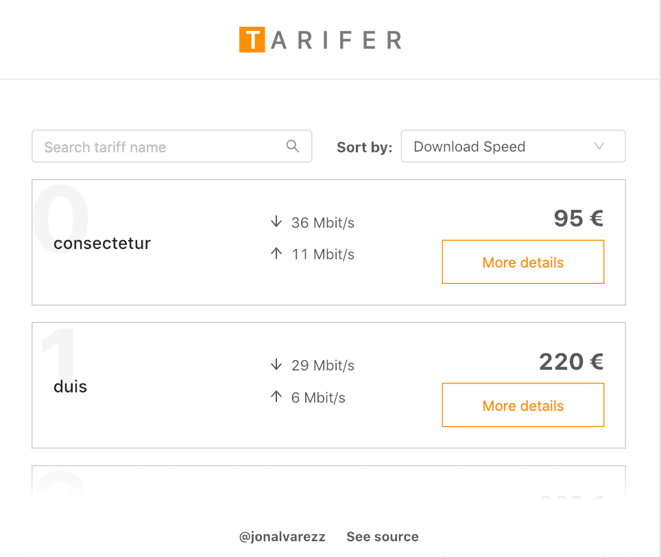

✴️️ This is React application that list object using a fake API to play around with Hooks as `useReducer`, `useMemo`, `useContext`, `useState` and React Context, to create a familiar, flexible and yet powerful Redux-like state management without third-party libraries.

[Try Online](https://jonalvarezz.github.io/tarifer-app)



## Technical Features

- Styled componentes.
- React Context + Hooks for Redux-like architecture.
- React Hooks: useState, useEffect, useMemo, useContext to manage logic.
- Antd library

## UI Engineering Concepts

- Use React built-ins to create an Redux-like state management architecture
- Logic can be easily extracted, moved and shared thanks to React hooks.
- Memoization to avoid unnecesary calculations after re renders.
- Scoped CSS

[More about the created Redux-like architecture](http://jonalvarezz.com/articles/replacing-redux-with-context-and-hooks/).

## Run it locally

Download, install, and run.

```
git clone git@github.com:jonalvarezz/tarifer-app.git
cd tarifer-app
yarn && yarn start
```

## FAQ

### I am not able to see the online demo.

Since I am using the public, free and non-authenticated GitHub API, you may have reached the [rate limit](https://developer.github.com/v3/#rate-limiting). Try [running it locally](#run-it-locally) instead.

Otherwise you can wait until the rate limit get reset. If you take a look to the DevTool's console you will get a hint on the remaining time.

## Available Scripts

In the project directory, you can run:

### `npm start`

Runs the app in the development mode.<br>
Open [http://localhost:3000](http://localhost:3000) to view it in the browser.

The page will reload if you make edits.<br>
You will also see any lint errors in the console.

### `npm test`

Launches the test runner in the interactive watch mode.<br>
See the section about [running tests](https://facebook.github.io/create-react-app/docs/running-tests) for more information.

### `npm run build`

Builds the app for production to the `build` folder.<br>
It correctly bundles React in production mode and optimizes the build for the best performance.

The build is minified and the filenames include the hashes.<br>
Your app is ready to be deployed!

See the section about [deployment](https://facebook.github.io/create-react-app/docs/deployment) for more information.

### `npm run eject`

**Note: this is a one-way operation. Once you `eject`, you can’t go back!**

If you aren’t satisfied with the build tool and configuration choices, you can `eject` at any time. This command will remove the single build dependency from your project.

Instead, it will copy all the configuration files and the transitive dependencies (Webpack, Babel, ESLint, etc) right into your project so you have full control over them. All of the commands except `eject` will still work, but they will point to the copied scripts so you can tweak them. At this point you’re on your own.

You don’t have to ever use `eject`. The curated feature set is suitable for small and middle deployments, and you shouldn’t feel obligated to use this feature. However we understand that this tool wouldn’t be useful if you couldn’t customize it when you are ready for it.

This project was bootstrapped with [Create React App](https://github.com/facebook/create-react-app).
